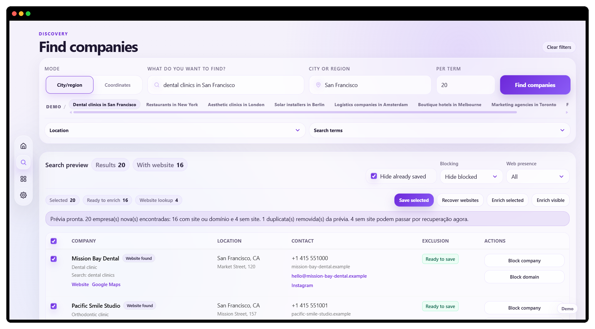
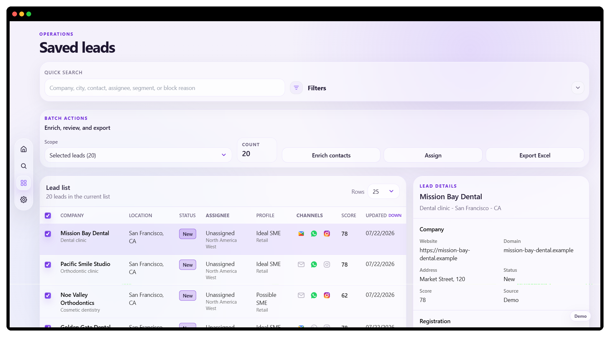

# Encontra.ai

B2B prospecting is not slow because sales teams cannot sell. It is slow because the lead list is usually garbage.

Encontra.ai turns a search by niche and location into a reviewed, enriched and assigned lead list ready for CRM export.

It previews provider results before import, prevents duplicates, finds public contact channels, scores possible company-record matches and sends uncertain data to manual review instead of presenting guesses as facts.

[Open the live demo](https://encontraaiapp.vercel.app) · Fictional data, no login or API keys required.

## Why I built it

I kept seeing sales work begin with the same mess: provider searches copied into spreadsheets, duplicate companies, missing contact details and records nobody could confidently verify.

I built Encontra.ai to handle the work between the initial market search and the first sales call while keeping the evidence, uncertainty and human decisions visible.

Search, preview, import, deduplicate, enrich, review, assign and export.

## Built with

**Frontend:** Next.js, React, TypeScript, Tailwind CSS, TanStack Query and TanStack Table  
**Backend:** Python, FastAPI, SQLAlchemy and pytest  
**Integrations:** Google Places, geocoding, company registries and public website enrichment  
**Delivery:** Docker, Vercel and GitHub Actions

