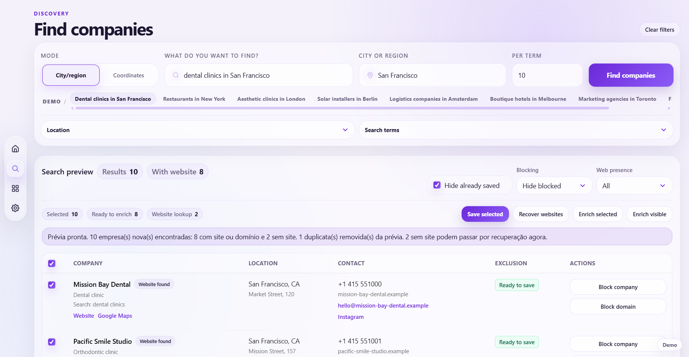

# Encontra.ai

[](https://github.com/HanuBehr/encontraaiapp/actions/workflows/ci.yml)
[](https://encontraaiapp.vercel.app)

Encontra.ai turns a market search into a reviewed lead list without pretending provider data is clean.

It handles discovery, duplicate prevention, contact enrichment, company-record evidence scoring, manual review, assignment rules and CRM-ready Excel exports.

[Open the live demo](https://encontraaiapp.vercel.app) · Fictional data, no login or API keys required.



## Why I built it

Sales teams rarely start with a clean market. They start with a niche, a location and a pile of provider results that still need to be checked, deduplicated, enriched and reorganized before anyone can use them.

I built Encontra.ai around that work between the search and the first sales call. The goal was not to generate the largest possible spreadsheet. It was to make each step visible, reviewable and difficult to corrupt silently.

## How it works

```text
Market search -> Preview -> Import -> Dedupe -> Enrichment -> Company review -> Assignment -> Export
