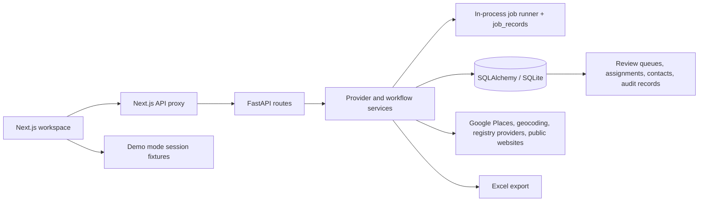

# Encontra.ai Architecture

Encontra.ai is a lead preparation workspace for B2B discovery, enrichment, review and export. The public demo is intentionally simplified and uses fictional browser-session data; backend-backed deployments use the FastAPI service and configured provider keys.

## Frontend Workspace And API Proxy

The `web/` app is a Next.js workspace. It owns the product interaction model: discovery forms, guided demo searches, preview tables, saved lead operations, batch actions, review queues, settings and bilingual UI state. In backend-backed mode the frontend talks through a Next.js API proxy so backend provider keys stay server-side and are never exposed as `NEXT_PUBLIC_*` values.

Demo mode is selected with `NEXT_PUBLIC_DEMO_MODE=true`. In that mode frontend API clients use `web/lib/demo/*` instead of the backend proxy. Demo data is fictional, session-scoped and language-isolated so reviewers can evaluate the workflow without provider calls, secrets or shared backend state.

## FastAPI Provider And Service Layer

The backend is a FastAPI app organized around route modules, SQLAlchemy models/repositories and service modules. Routes validate API requests and delegate work to services. Services own provider calls, deduplication, enrichment, evidence scoring, company review state, assignment and export generation.

Provider boundaries are explicit. Google Places and geocoding live under `app/services/providers/`, as do optional company registry providers. Provider errors are classified into operational categories such as rate-limited, configuration, not-found, timeout and provider-unavailable. Secrets are read from environment-backed settings and are not logged.

## Discovery, Preview And Import

Discovery starts with a market query and location. The backend resolves provider results into normalized discovery candidates and returns a preview before anything is persisted. Preview-first discovery lets users inspect provider data, exclusion matches, recovered websites and already-saved matches before import.

Import is idempotent at the lead level. The import path creates raw discovery records and saved leads only for selected, non-blocked preview rows that do not already match existing leads. Existing saved leads are detected by provider identifiers, domains, phone signals and conservative name/location matching. Ambiguous matches are kept out of silent merge paths.

## Deduplication

Deduplication runs both before import and inside saved-lead operations. It uses normalized business names, domains, contact signals, addresses and location context. The goal is duplicate prevention, not aggressive record collapse. When a duplicate pair is confirmed, the service preserves a canonical lead and marks the duplicate relationship rather than deleting data.

## Enrichment And Contact Provenance

Website enrichment crawls public pages with bounded page profiles, robots checks, timeouts and contact-page discovery. Extracted emails, phones, WhatsApp links, Instagram links and contact forms are normalized and stored with provenance. Each contact records source kind, source URL, confidence and source record metadata so exported contacts can be traced back to the page or provider result that produced them.

Each enrichment run writes audit records through `LeadEnrichmentRecord`: attempted/fetched pages, HTTP status, robots state, extracted fields, confidence scores, inferred material signals and notes. This makes enrichment explainable and debuggable instead of a black box.

## Evidence Scoring And Company Review

Company-record enrichment combines website evidence, public registry data and optional paid company-search provider candidates. Scoring considers business name, legal/trade names, location, address number, phone area, email/domain signals, category/CNAE hints and conflicts. High-confidence matches can fill company identifiers automatically; medium or ambiguous matches are stored as review candidates and shown in the CNPJ review queue.

The service deliberately avoids silent assignment of uncertain company records. Review state and candidate metadata are retained so operators can approve the correct entity or keep a lead without a company identifier.

## Organization Ownership And Assignment Rules

The current backend includes organization-scoped ownership fields across leads, contacts, enrichment records, assignment rules, sales regions and market taxonomy. Repository and service tests cover cross-organization boundaries so records, rules and assignment configuration from one organization do not leak into another.

This is not full account management. Authentication, billing and complete multi-tenant account administration are intentionally listed as limitations. The current organization model supports ownership and rule isolation inside the backend data model, not a finished SaaS tenant lifecycle.

Assignment rules map leads to sales reps using regions, segments, subsegments and rule priority. Batch assignment supports dry runs and overwrite controls, which lets operators preview changes before writing assignments.

## Export

Exports are generated server-side as Excel workbooks. Export scope can come from selected leads, the current filtered list or the latest import batch. Export rules prefer confirmed/approved company-record data and avoid sending uncertain review candidates as if they were truth. Export operations emit structured logs with correlation IDs and payload size, but not sensitive contact values.

## Job Processing, Retries And Operational Visibility

Provider-heavy batch operations run through an explicit in-process job abstraction. The current scale does not require distributed infrastructure, so jobs are recorded in the application database and executed synchronously within the request while preserving existing API response contracts.

Each job has an idempotent job key, type, correlation ID, state, attempt count, max attempts, payload metadata, result metadata, error class, error message, start time, retry time and completion time. Transient provider failures use bounded retries with short backoff. Terminal failures are recorded as failed jobs.

Structured logs are emitted for discovery, preview enrichment, import, dedupe, assignment, export and job attempts. Logs include correlation IDs and operational counts. Sanitization avoids logging secrets or sensitive contact data.

## SQLite Today, PostgreSQL Path Later

SQLite is the current default because it keeps local development, review and small pilot deployments simple. It is appropriate for the public case study, local Docker setup and single-node trials. SQLite lock handling exists where needed, and persistent local data is mounted under `./data` in Docker.

The managed PostgreSQL migration path is straightforward because the app already uses SQLAlchemy models and repository/service boundaries. Production hardening should add managed PostgreSQL, migrations, backups, stricter connection settings, background worker infrastructure where needed, authentication, audit policies and observability integration.

## Demo Mode Versus Backend-Backed Deployment

Hosted demo mode is frontend-only and uses fictional browser-session data. It demonstrates the product workflow without backend infrastructure, API keys or paid provider calls.

Backend-backed mode runs the FastAPI service, SQLAlchemy persistence, provider adapters and export pipeline. It is the path for real discovery and enrichment with private API keys and private client data.

## Deliberate Limitations

The public repository does not include completed authentication, billing, campaign automation, full CRM functionality or complete multi-tenant account management. It also does not claim production-scale distributed background processing. The public demo uses fictional data and a simplified deployment model. Commercial implementations and client data remain private.
